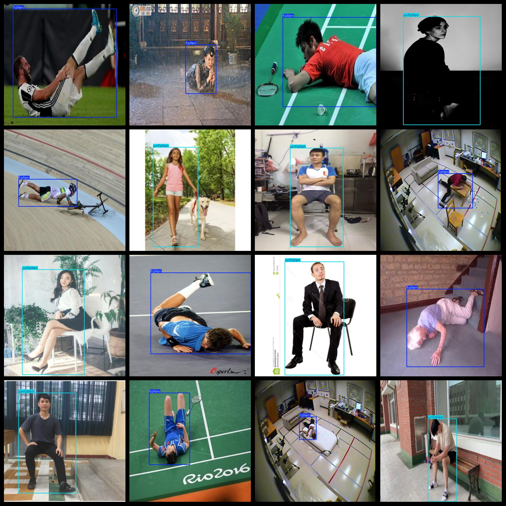
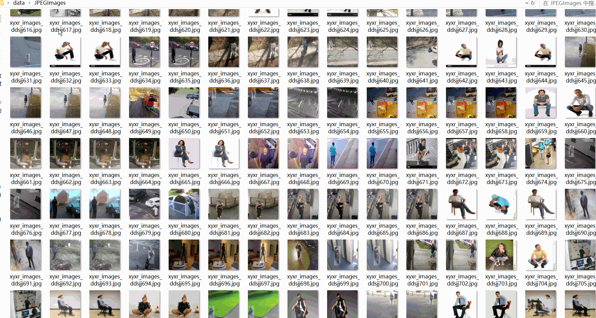

# Fall Detection Dataset 4250 imagesVOC+YOLO format

The dataset of 4250 images for fall detection in VOC+YOLO format.

Dataset format: Pascal VOC format + YOLO format (the txt file does not contain the split path, it only contains jpg images and corresponding VOC format xml files and yolo format txt files)

Number of images (Total number of jpg files): 4250

Number of xml files: 4250

Number of annotations (number of txt files): 4250

Label count: 2

The Github repository is: datasets_sl

["fallen", "unfallen"]

Number of boxes labeled in each category:

Fallen Frames = 2110

unfallen frame count = 2140

Total frame count: 4250

Number of images per category:

Fallen's possession count = 2110

Unfallen's total image count = 2140

Image resolution: 640x640

Use the labeling tool: labelImg

Dataset Augmentation: Yes

Rules for annotation: Draw a rectangle around the category.

Important note: The dataset does not have been divided into training, validation, and testing sets.

Special Disclaimer: This dataset does not guarantee the accuracy of the trained models or weight files.

Annotation and image details are as follows:

## Images

---

Here is a pay link on Stripe (https://buy.stripe.com/3cs8yP7sY87d0vu9AB). Please contact me lonlonago@foxmail.com after funding $89, and I will send you a complete data files, thank you!

